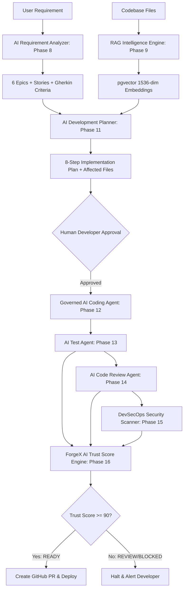

# ForgeX AI Architecture & Agentic Intelligence (Phase 8–16, 21)

This document provides a technical deep-dive into ForgeX's AI microservice, RAG vector retrieval pipeline, and signature Trust Score governance algorithm.

---

## 1. Agentic AI Ecosystem

---

## 2. RAG Pipeline Mechanics (Phase 9)

1. **Chunking**: Code files (`SecurityConfig.java`, `UserService.java`, `PaymentService.java`) are parsed into AST symbols (classes, methods).
2. **Dense Embeddings**: Chunks are embedded into vector vectors and stored in PostgreSQL using `pgvector`.
3. **Cosine Similarity Search**:
   $$\text{similarity} = \frac{\mathbf{u} \cdot \mathbf{v}}{\|\mathbf{u}\| \|\mathbf{v}\|}$$
4. **Context Injection**: Relevant symbols are provided to the LLM with prompt isolation to prevent prompt injection.

---

## 3. Mathematical AI Trust Score Formula (Phase 16 ⭐)

$$\text{Trust Score} = 0.20 \times C_{\text{req}} + 0.20 \times C_{\text{test}} + 0.20 \times S_{\text{sec}} + 0.15 \times Q_{\text{code}} + 0.10 \times D_{\text{dep}} + 0.15 \times R_{\text{ai}}$$

### Score Thresholds
- **90 – 100** ➔ **`READY`** (Deployment Gate: `DEPLOYMENT_APPROVED`)
- **75 – 89** ➔ **`REVIEW`** (Deployment Gate: `PEER_REVIEW_REQUIRED`)
- **50 – 74** ➔ **`CAUTION`** (Deployment Gate: `ADDITIONAL_TESTS_REQUIRED`)
- **< 50** ➔ **`BLOCKED`** (Deployment Gate: `DEPLOYMENT_BLOCKED`)
