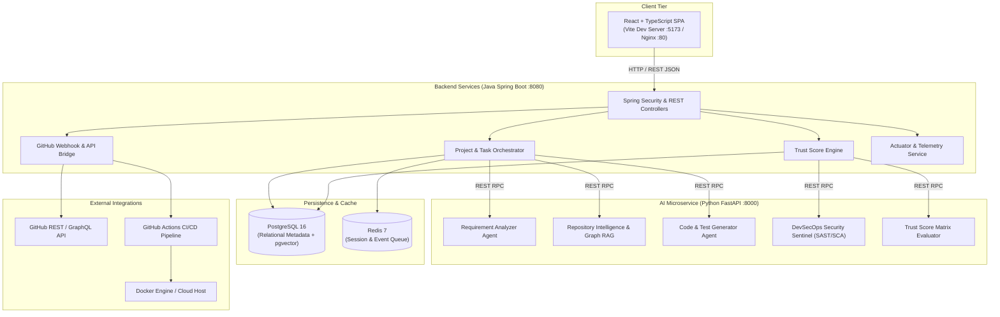
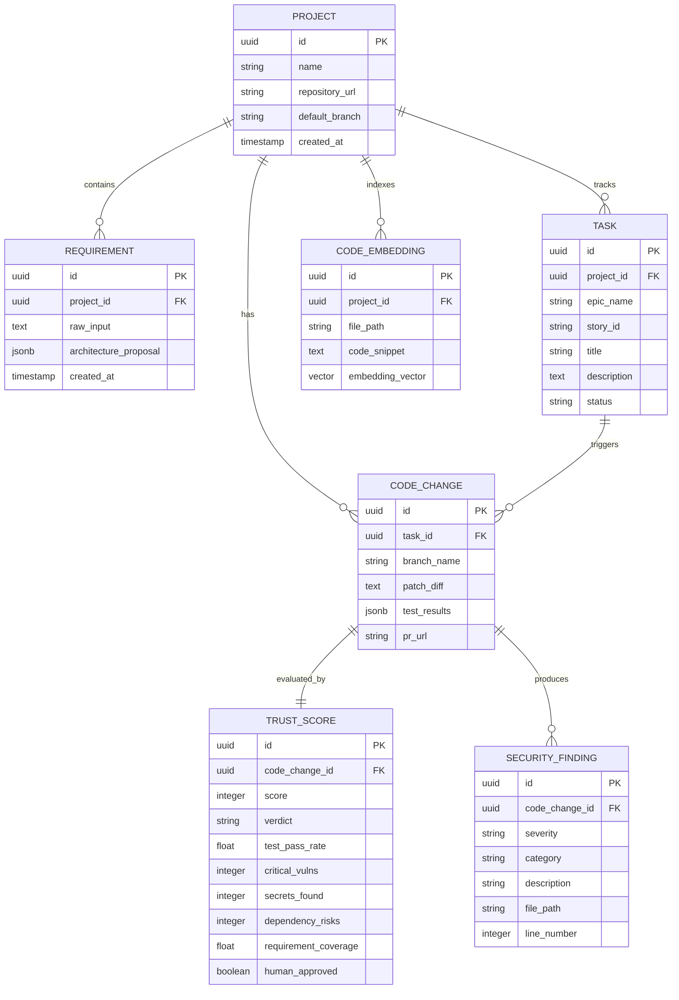

# ForgeX — System Architecture & Design Specification

> **Platform Architecture Document**  
> **Target Subsystems:** Frontend Dashboard, Spring Boot Core Backend, FastAPI AI Engine, PostgreSQL + pgvector, Redis, Docker Infrastructure.

---

## 1. System Topology & Microservices

ForgeX follows a polyglot microservice architecture designed for separation of concerns, scalability, and resilience.



---

## 2. API Contract & Communication Matrix

### Spring Boot Backend Core (Port 8080)
| Endpoint | Method | Description |
|---|---|---|
| `/api/v1/projects` | `GET`, `POST` | List and create engineering projects |
| `/api/v1/projects/{id}` | `GET`, `DELETE` | Retrieve project details and associated repositories |
| `/api/v1/requirements/analyze` | `POST` | Ingest raw prompt and delegate to AI service for epic breakdown |
| `/api/v1/tasks` | `GET`, `POST` | Manage user stories, sprint tasks, and status transitions |
| `/api/v1/code/generate` | `POST` | Trigger implementation plan, code synthesis, and automated tests |
| `/api/v1/security/scan` | `POST` | Execute static analysis and dependency vulnerability audit |
| `/api/v1/trust-score/evaluate`| `POST` | Compute comprehensive AI Change Trust Score |
| `/api/v1/github/pull-request` | `POST` | Assemble verified PR and dispatch to GitHub repository |
| `/api/v1/health` | `GET` | Return system health, memory, CPU, and microservice status |

### Python FastAPI AI Engine (Port 8000)
| Endpoint | Method | Description |
|---|---|---|
| `/api/ai/analyze-requirement` | `POST` | Parses natural language requirements into Epics, Stories & Architecture |
| `/api/ai/repo-intelligence` | `POST` | Scans repository directory graph, finds affected files and dependencies |
| `/api/ai/generate-code` | `POST` | Synthesizes target code diff alongside 4 categories of unit/integration tests |
| `/api/ai/security-scan` | `POST` | Inspects code for SQLi, XSS, exposed secrets, and package CVEs |
| `/api/ai/trust-score` | `POST` | Deterministic weighted scoring algorithm evaluating change safety |
| `/health` | `GET` | Health status and AI model readiness check |

---

## 3. Database Schema (PostgreSQL + pgvector)



---

## 4. DevSecOps Execution Workflow

```
Developer / PM: "Create parking reservation API"
          │
          ▼
1. AI Requirement Analyzer
   - Decomposes into Epic-23: Parking Slot Allocation
   - Creates User Story US-101: "POST /api/v1/reservations"
          │
          ▼
2. Repository Intelligence Scan
   - Identifies: ReservationController.java, SlotRepository.java, PaymentClient.java
   - Validates data model conventions & Spring Boot annotations
          │
          ▼
3. Dual Synthesis (Code + Tests)
   - Generates ReservationService implementation
   - Generates JUnit 5 Test Suite (24 tests: normal, boundary, concurrency)
          │
          ▼
4. Security Sentinel Scan
   - SAST check: No SQL string concatenation (passes)
   - Secret scan: No hardcoded API keys detected (passes)
   - Dependency check: 1 medium vulnerability flagged
          │
          ▼
5. AI Change Trust Score Computed: 88/100 (SAFE TO REVIEW)
   - Test Pass Rate: 24/24 (100%)
   - Critical Vulns: 0
   - Hardcoded Secrets: 0
   - Requirement Coverage: 95%
          │
          ▼
6. Governed Pull Request
   - Dispatched to GitHub with full verification badges
   - Triggers CI workflow: Docker image compilation & verification
```
