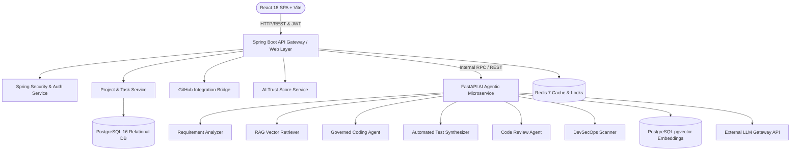
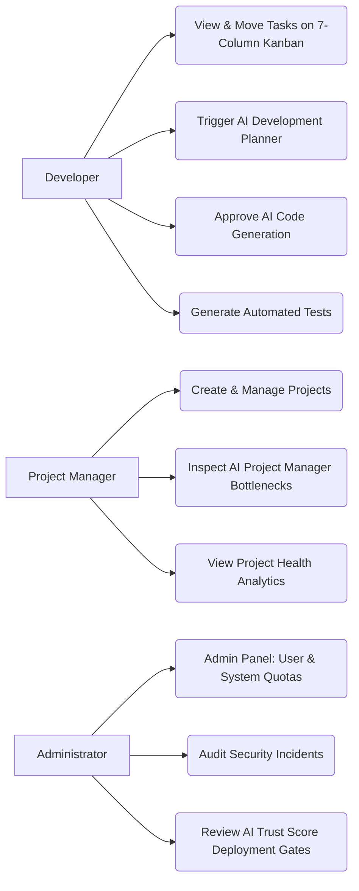
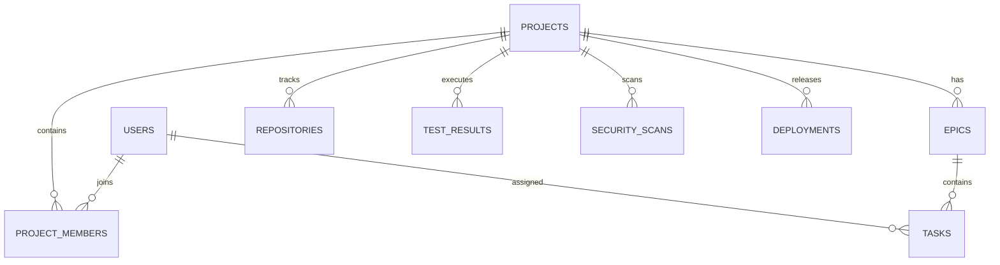
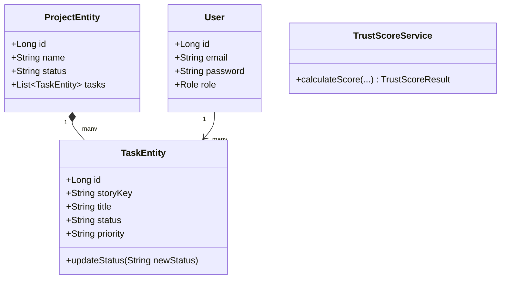
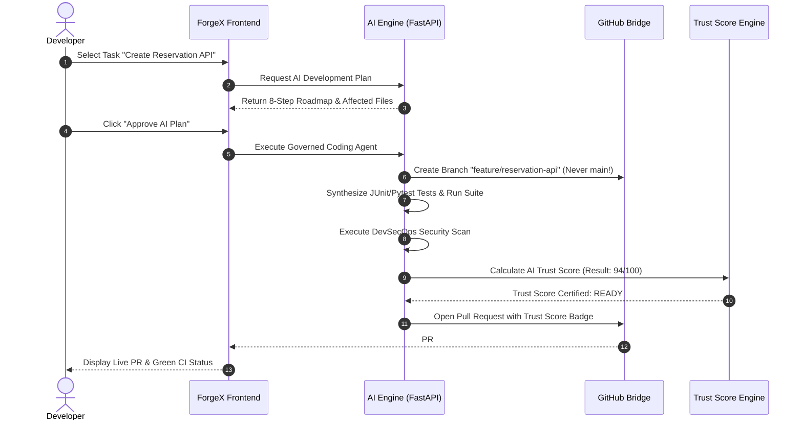
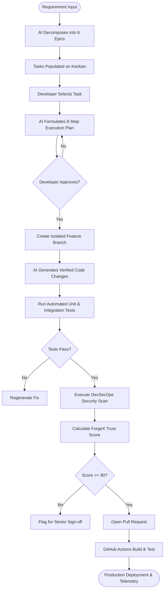
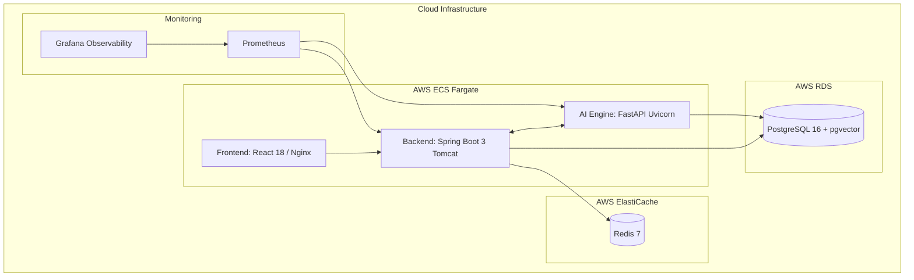
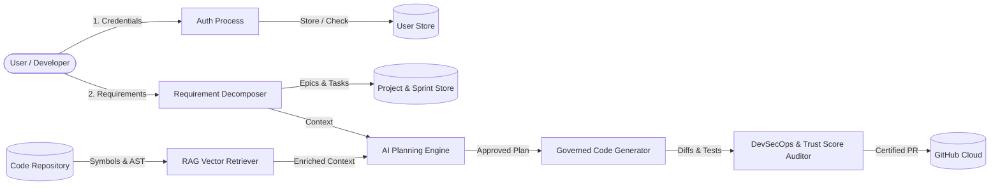

# ForgeX Architecture Diagrams (Phase 28)

Comprehensive Mermaid architectural diagrams covering all system dimensions.

---

## 1. System Architecture Diagram

---

## 2. Use Case Diagram

---

## 3. Entity-Relationship (ER) Diagram

---

## 4. Class Diagram

---

## 5. Sequence Diagram: Governed AI Execution & PR Workflow

---

## 6. Activity Diagram: Requirement to Deployment Lifecycle

---

## 7. Deployment Diagram

---

## 8. Data Flow Diagram (DFD Level 1)

