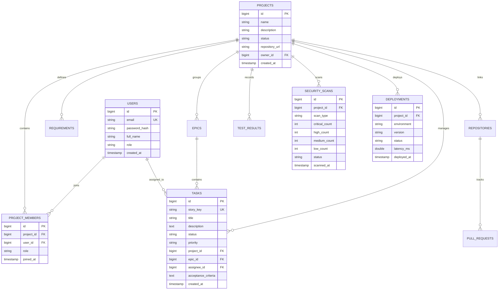

# ForgeX Database Architecture & Schema Specification

Complete relational database schema and vector storage architecture for ForgeX.

---

## 1. Storage Overview

- **Primary Relational Store**: PostgreSQL 16 (production) / H2 in-memory (development testing)
- **Vector Embeddings Store**: PostgreSQL `pgvector` extension (`1536`-dimension dense vector embeddings for RAG)
- **In-Memory Cache**: Redis 7 Alpine (distributed locks, session tokens, rate limiting counters)

---

## 2. Core Relational Entities (14 Tables)



---

## 3. Database Indexes for Performance

```sql
-- Fast query lookup for project tasks by status
CREATE INDEX idx_tasks_project_status ON tasks(project_id, status);

-- Fast lookup for project members
CREATE INDEX idx_project_members_user ON project_members(project_id, user_id);

-- Fast lookup for user authentication
CREATE INDEX idx_users_email ON users(email);

-- Vector indexing for RAG similarity search (IVFFlat with Cosine distance)
CREATE INDEX idx_code_chunks_embedding ON code_chunks 
USING ivfflat (embedding vector_cosine_ops) WITH (lists = 100);
```
