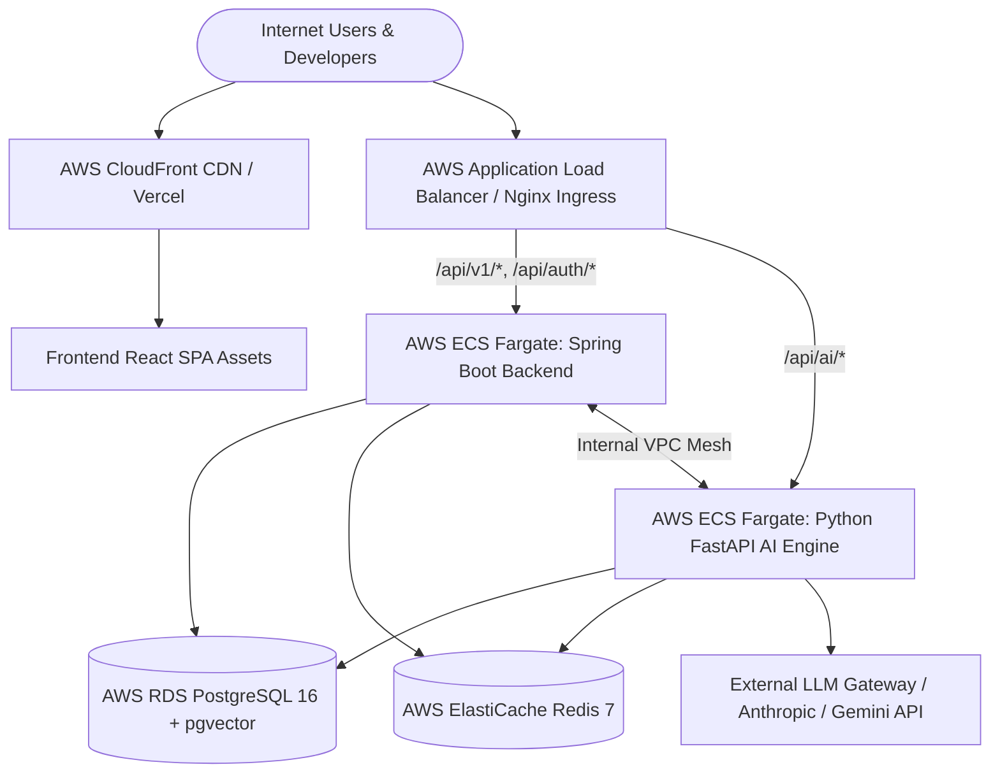

# ForgeX Cloud Production Deployment Guide (Phase 19)

This guide documents the enterprise cloud architecture and production deployment process for ForgeX.

---

## 1. Cloud Architecture Overview



---

## 2. Infrastructure Breakdown

| Component | Target Cloud Provider | Recommended Spec | Port |
|---|---|---|---|
| **Frontend SPA** | AWS S3 + CloudFront / Vercel | Global CDN Edge Distribution | 443 / 80 |
| **Backend Core** | AWS ECS (Fargate) / EC2 | 2 vCPU, 4GB RAM (Auto-scaling 2-6 tasks) | 8080 |
| **AI Microservice** | AWS ECS (Fargate) / EC2 | 2 vCPU, 4GB RAM (Auto-scaling 2-4 tasks) | 8000 |
| **Relational Database** | AWS RDS PostgreSQL 16 | `db.t4g.medium` Multi-AZ + `pgvector` extension | 5432 |
| **In-Memory Cache** | AWS ElastiCache Redis | `cache.t4g.small` Clustered | 6379 |
| **Secrets & Keys** | AWS Secrets Manager | KMS-encrypted environment variables | - |

---

## 3. Step-by-Step Deployment Instructions

### Step 1: Local Docker Verification
Verify all 5 services build and boot cleanly together:
```bash
# From project root
docker compose up --build -d

# Verify container health
docker compose ps
```

### Step 2: Container Image Build & Push (AWS ECR)
```bash
# 1. Authenticate with AWS ECR
aws ecr get-login-password --region us-east-1 | docker login --username AWS --password-stdin <aws_account_id>.dkr.ecr.us-east-1.amazonaws.com

# 2. Build and tag images
docker build -t forgex-backend:latest ./backend
docker tag forgex-backend:latest <aws_account_id>.dkr.ecr.us-east-1.amazonaws.com/forgex-backend:latest

docker build -t forgex-ai-service:latest ./ai-service
docker tag forgex-ai-service:latest <aws_account_id>.dkr.ecr.us-east-1.amazonaws.com/forgex-ai-service:latest

# 3. Push to ECR
docker push <aws_account_id>.dkr.ecr.us-east-1.amazonaws.com/forgex-backend:latest
docker push <aws_account_id>.dkr.ecr.us-east-1.amazonaws.com/forgex-ai-service:latest
```

### Step 3: Deploy AWS ECS Fargate Tasks
Deploy via AWS ECS Task Definitions with CloudWatch logging and VPC security groups:
```json
{
  "family": "forgex-backend-task",
  "networkMode": "awsvpc",
  "requiresCompatibilities": ["FARGATE"],
  "cpu": "1024",
  "memory": "2048",
  "containerDefinitions": [
    {
      "name": "forgex-backend",
      "image": "<aws_account_id>.dkr.ecr.us-east-1.amazonaws.com/forgex-backend:latest",
      "portMappings": [{ "containerPort": 8080, "protocol": "tcp" }],
      "environment": [
        { "name": "SPRING_PROFILES_ACTIVE", "value": "prod" },
        { "name": "SPRING_DATASOURCE_URL", "value": "jdbc:postgresql://forgex-rds.cluster-xyz.us-east-1.rds.amazonaws.com:5432/forgex_db" },
        { "name": "FORGEX_AI_SERVICE_URL", "value": "http://forgex-ai.internal:8000" }
      ],
      "secrets": [
        { "name": "SPRING_DATASOURCE_PASSWORD", "valueFrom": "arn:aws:secretsmanager:us-east-1:123456789:secret:forgex/db-pass" },
        { "name": "FORGEX_JWT_SECRET", "valueFrom": "arn:aws:secretsmanager:us-east-1:123456789:secret:forgex/jwt-key" }
      ]
    }
  ]
}
```

### Step 4: Frontend Deployment (Vercel or AWS S3 + CloudFront)
For Vercel deployment:
```bash
cd frontend
npm install -g vercel
vercel --prod
```
Set Vercel environment variables:
- `VITE_BACKEND_URL`: `https://api.forgex.io/api/v1`
- `VITE_AI_SERVICE_URL`: `https://ai.forgex.io`
